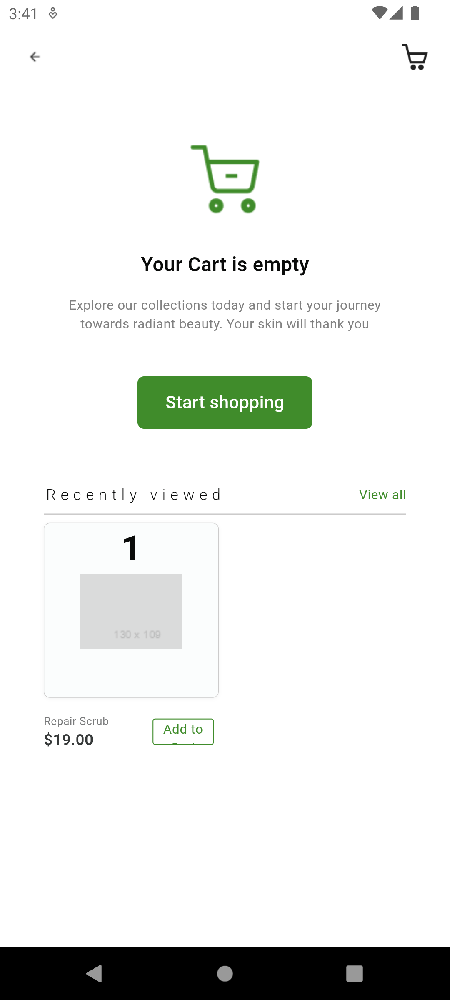
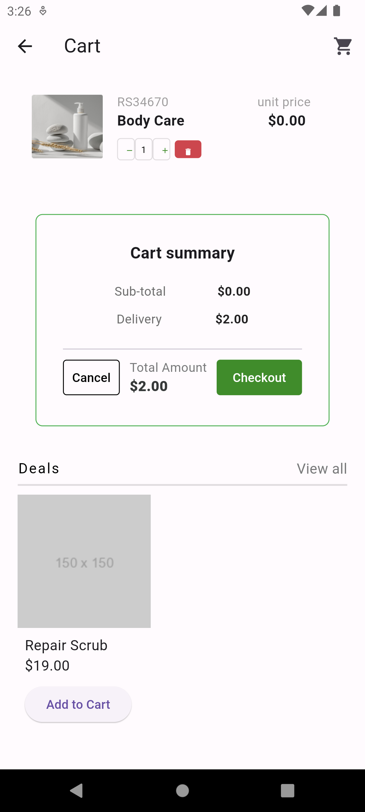
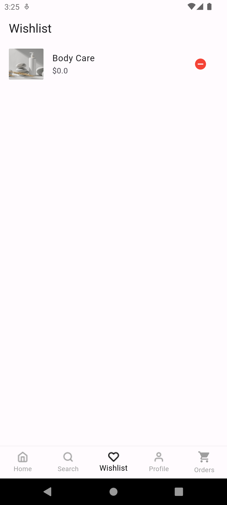
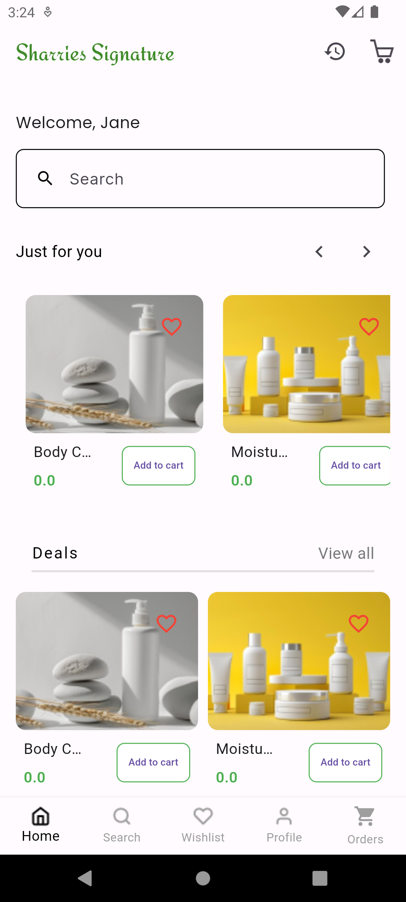

# sharries_signature ReadMe
The Flutter project is a mobile shopping app with a user-friendly checkout and payment system.

Users can enter and validate payment details, and provide contact information. The app offers a wide range of products, easy cart management, and a seamless checkout process.

Built with Flutter, it uses Provider for state management. It features a bottom navigation bar for easy navigation, a scrollable grid view for product exploration, and a robust cart system for an enhanced shopping experience

## Table of Contents
-[Features](#features)
-[Installation](#installation)
-[Usage](#usage)
-[ProjectStructure](#project structure)
-[Contributing](#configuration)
-[License](#license)

## Features
Home Screen: Displays product categories and acollections.

Category Items Screen: Shows items for a selected category in a scrollable grid view.

Add to Cart: Allows users to add items to their cart from the product listing.

Cart Screen: Shows all items added to the cart with options to increase/decrease quantity and view total price.

Checkout Screen: Allows users to proceed with their purchase.

Form Validation: Ensures that the user enters valid card details.

State Management: Uses Provider for managing the cart state.

Wishlist: Allows user to add to wishlist of products

## Installation
Follow these steps to install and run shopping app on your system.
Clone the repository:

bash
git clone https://github.com/shallom-dot/Sharri-e-Signature-app
cd Sharrie_Signature
Install dependencies:

bash
Copy code
flutter pub get

Set up environment variables:
Create a .env file in the root of your project and add your API configuration:
API_URL=https://api.example.com
API_KEY=your_api_key
ORGANIZATION_ID=your_organization_id
APP_ID=your_app_id
API_IMAGE_URL=https://images.example.com/

Run the app:
bash
Copy code
flutter run

## Usage
All Products: Displays list of products
## Project Structure

sharries_signature/
├── android/
├── assets/
│   ├── images/
│   │   ├── icons8-shopping-cart-48.png
│   │   ├── poster.png
│   │   ├── poster (1).png
│   │   ├── poster (2).png
│   │   ├── poster (3).png
├── ios/
├── lib/
│   ├── main.dart
│   ├── models/
│   │   ├── api_model.dart
│   │   ├── cartmodel.dart
│   │   ├── product_model.dart
│   │   ├── wishlist_model.dart
│   ├── screens/
│   │   ├── cart_screen.dart
│   │   ├── cartwithsomething.dart
│   │   ├── checkoutscreen.dart
│   │   ├── collection_screen.dart
│   │   ├── order_history_screen.dart
│   │   ├── productdetails.dart
│   ├── services/
│   │   └── product_services.dart
│   ├── utilities/
│   │   ├── image_textcard.dart
│   │   ├── productcard.dart
│   │   ├── reusable_underline.dart
├── pubspec.yaml
|__.env

## Screenshots

## watch video here
[watch here](https://drive.google.com/drive/u/0/folders/1R8LQOs9lWTXdpZ7Z9eF1mXuczmuYOEmx)

## download link
[Download the apk here](https://drive.google.com/drive/u/0/folders/1R8LQOs9lWTXdpZ7Z9eF1mXuczmuYOEmx)

## Contributing
Contributions are welcome! Please follow these steps to contribute:

Fork the repository.
Create a new branch (git checkout -b feature-branch).
Make your changes.
Commit your changes (git commit -m 'Add some feature').
Push to the branch (git push origin feature-branch).
Open a pull request.
## License
This project is licensed under the MIT License. See the LICENSE file for details.

